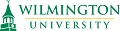
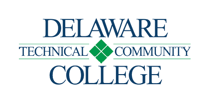
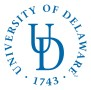

---

layout: col-sidebar
title: OWASP Delaware
tags: delaware

region: North America

---
Welcome to the Delaware chapter homepage. 
Please follow our chapter on [Meetup.com](https://bit.ly/owaspDE) and [Twitter](https://twitter.com/owaspde).

Meetup is the primary source for meeting information and signups. **Please RSVP to meetings there**, but mark yourself as not coming if you change your mind.  That helps us plan for meeting logistics. 

> During hands-on labs there are only so many open seats, so an accurate head count is appreciated.

# Speakers & Sponsors Wanted

Please contact [David Rhoades](mailto:david.rhoades@owasp.org) if you would like to present at one of our chapter meetings, or if you have some space to donate for a meeting.
Northern Delaware is ideal, but we are flexible - especially if you have people in your area willing to attend.

# Meeting Sponsors

The following are the list of organizations who have generously supported our chapter with meeting space:

<table cellpadding="15" cellspacing="0">
<tr>
<td>

</td>
</tr>
<tr>
<td>

</td>
</tr>
<tr>
<td>

</td>
</tr>
</table>
