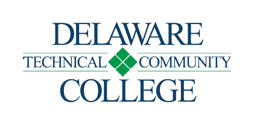

---

layout: col-sidebar
title: OWASP Delaware
tags: delaware
region: North America
meetup-group: OWASP-Delaware-Chapter
postal-code: 19720
country:  USA

---
Welcome to the Delaware chapter homepage. 
Please follow our chapter here at OWASP.org.

NEW: The Meetup.com group is gone, for us as well as most other OWASP chapters because...reasons.
¯\_(ツ)_/¯

The best way to stay in the loop on upcoming meetings is to <a href="https://discord.gg/EHUznhj" target="_blank" rel="noopener">join our chapter Discord server.</a>

Until we find a new method of posting meetings and geting RSVP counts, we will post meetings here on this page and on Discord.

Upcoming meetings are shown below.  

# Speakers & Supporters Wanted

Please contact [David Rhoades](mailto:david.rhoades@owasp.org) if you would like to present at one of our chapter meetings, or if you have some virtual resources to donate (e.g., CTF ranges, online training, etc.).

When donating space for our meetings Northern Delaware is ideal, but we are flexible - especially if you have people in your area willing to attend.

# Chapter Supporters

The following are the list of organizations who have generously supported our chapter with volunteers and meeting space:

<table cellpadding="15" cellspacing="0">
<tr>
<td>

</td>
<td>

</td>
<td>

</td>
</tr>
</table>

# Next Meeting/Event(s)

Soon...probably Feb 2026.

# Prior Events

Lost to the sands of time due to the Meetup.com account being closed out by OWASP global leadership.

# Stay in the loop

<a href="https://discord.gg/EHUznhj" target="_blank" rel="noopener">Join our chapter Discord server for live broadcast.</a>

